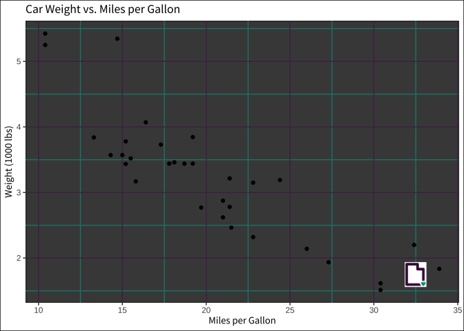
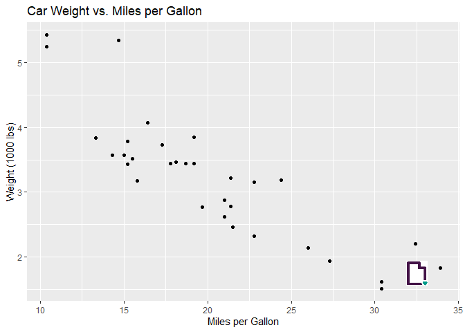

# Using themes in ggplot2


``` r
options( warn = -1)
library(ggplot2)
library(yaml)
library(sysfonts)
library(showtextdb)
library(showtext)

library (bslib)
```


    Attaching package: 'bslib'

    The following object is masked from 'package:utils':

        page

``` r
# For accessing fonts


# A place to save things
brandingr_envir <- new.env(parent = emptyenv())

#' Sets the ggplot2 theme to the one specified in the _brand.yml file.
#' @param fn The filename of the theme to be used.
brandingr_set_ggplot <- function(fn) {

    # Reading the YAML file
    doc <- yaml::read_yaml(fn)

    # Getting colors
    doc_color <- doc$color

    # Replacing names
    to_modify <- doc_color[setdiff(names(doc_color), "palette")] |> names()
    for (i in seq_along(to_modify)) {
        doc_color[[to_modify[i]]] <- doc_color$palette[[
            doc_color[[to_modify[i]]]
            ]]
    }

    # Processing the family
    families <- lapply(doc$typography$fonts, "[[", "family") |>
        unlist() |>
        unique()

    use_source_sans <- FALSE
    if ("Source Sans Pro" %in% families) {
        use_source_sans <- TRUE
        sysfonts::font_add_google("Source Sans Pro", "source_sans_pro")
        showtext::showtext_auto()
    }

    # Saving in the environment
    brandingr_envir$doc <- doc
    brandingr_envir$color <- doc_color
    brandingr_envir$font <- doc$typography
    

    # Adding the desired font
    new_theme <- ggplot2::theme(
        panel.background = ggplot2::element_rect(fill = doc_color$foreground),
        plot.background = ggplot2::element_rect(fill = doc_color$background),
        panel.grid.major = ggplot2::element_line(color = doc_color$primary),
        panel.grid.minor = ggplot2::element_line(color = doc_color$secondary)
    )
    
    if (use_source_sans)
        new_theme <- new_theme +
            ggplot2::theme(
                title = ggplot2::element_text(family = "source_sans_pro")
            )

    brandingr_envir$prev_theme <- ggplot2::theme_set(new_theme)

}

brandingr_reset_ggplot <- function() {
    ggplot2::theme_set(brandingr_envir$prev_theme)
}

# Function to add a logo in a ggplot2 plot
brandingr_add_logo <- function(grob, x = 0.9, y = 0.1, size = 0.05) {

        ggplot2::annotation_custom(
            grid::rasterGrob(
                png::readPNG(
                    brandingr_envir$doc$logo$images$icon$path
                ),
                x = x,
                y = y,
                width = grid::unit(size, "npc")
            )
        )
}
```

Calling

``` r
theme <- bs_theme(brand = TRUE)

# Extract the path of the discovered _brand.yml file
brand_info <- attr(theme, "brand")
brand_path <- brand_info$path
print(brand_path)
```

    [1] "C:/Users/willy/rprojects/rbranding/_brand.yml"

``` r
#brandingr_set_ggplot("bak_brand.yml")
brandingr_set_ggplot(brand_path)


# Example plot
data(mtcars)
p <- ggplot(mtcars, aes(x = mpg, y = wt)) +
    geom_point() +
    labs(title = "Car Weight vs. Miles per Gallon",
         x = "Miles per Gallon",
         y = "Weight (1000 lbs)") + 
  brandingr_add_logo()

# Producing
p
```



``` r
# Reproducing
brandingr_reset_ggplot()
p
```



``` r
# Create a theme object
theme <- bs_theme(brand = TRUE)

# Extract the path of the discovered _brand.yml file
brand_info <- attr(theme, "brand")
brand_path <- brand_info$path

print(brand_path)
```

    [1] "C:/Users/willy/rprojects/rbranding/_brand.yml"
