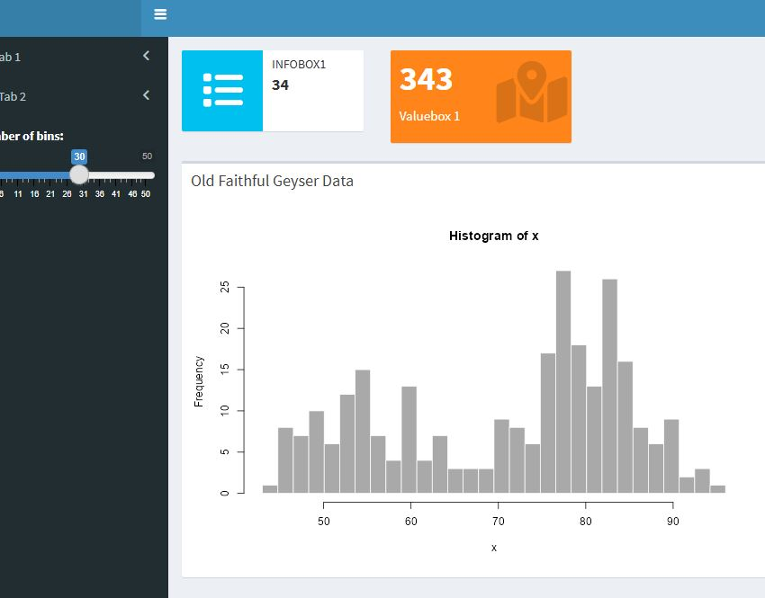
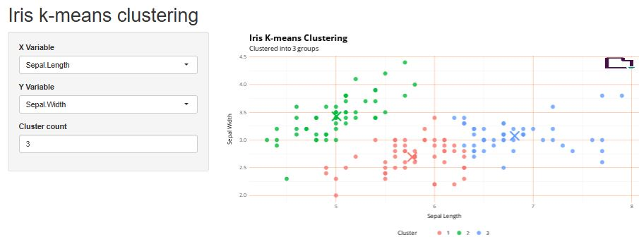

```{r, include = FALSE}
knitr::opts_chunk$set(
  collapse = TRUE,
  comment = "#>"
)
```

\

## Example: Histogram with controls on the left
```{r, echo=FALSE, out.width="50%"}
knitr::include_graphics("shiny2.jpg")
```
Install with: 
```{r, eval=FALSE}
rbranding::get_template("shiny_example")
shiny::runApp(".")
```

## Example: Historgram with controls and tabs
```{r, echo=FALSE, out.width="50%"}

```
Install with: 
```{r, eval=FALSE}
rbranding::get_template("shinyapp")
shiny::shinyAppFile("app.r")
```

## Example: Kmeans clustering with controls
Based on [this example](https://shiny.rstudio.com/gallery/kmeans-example.html)
```{r, echo=FALSE, out.width="50%"}

```
Install with: 
```{r, eval=FALSE}
rbranding::get_template("kmeans")
shiny::runApp(".")
```
 