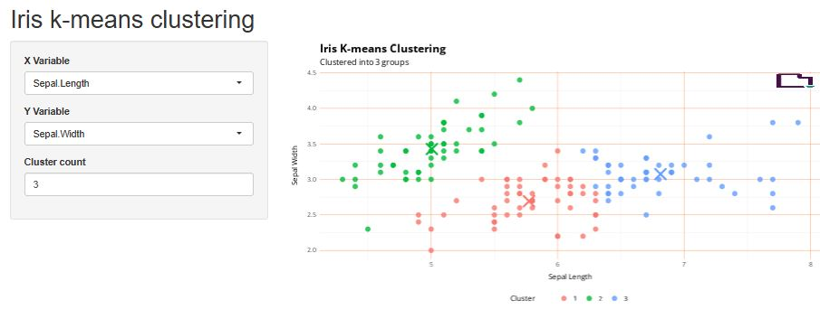

```{r, include = FALSE}
knitr::opts_chunk$set(
  collapse = TRUE,
  comment = "#>"
)
```

This vignette provides an overview of the templates available in the `rbranding` package. Use the `get_template()` function to install the template of your choice by specifying the `template_name` argument.


## Quarto Templates

### `quarto_website`: Simple Quarto Website Template

```{r, echo=FALSE, out.width="50%", fig.alt="Screenshot of a simple branded Quarto website"}
knitr::include_graphics("vignette-screenshots/qwebsite.jpg")
```

``` r
get_template("quarto_website")
```

Provides a basic structure for a Quarto website with multiple pages, navigation, and branding support.


### `quarto_ggplot2`: Quarto Report with Branded `ggplot2` Figures
```{r, echo=FALSE, out.width="50%", fig.alt="Screenshot of a branded ggplot2 scatterplot figure"}
knitr::include_graphics("vignette-screenshots/qggplot2.jpg")
```

``` r
get_template("quarto_ggplot2")
```

Provides a Quarto report setup that integrates `_brand.yml` and `ggplot2` for creating branded visualizations.


## Shiny App Templates

### `shiny_basic`: Simple Histogram Visualization Shiny App
```{r, echo=FALSE, out.width="50%", fig.alt="Screenshot of a simple branded Shiny app histogram"}
knitr::include_graphics("vignette-screenshots/shiny2.jpg")
```

``` r
get_template("shiny_basic")
shiny::runApp(".")
```

Provides a simple Shiny app that allows users to interactively adjust parameters and see the results in a histogram.


### `shiny_kmeans`: Simple K-means Clustering Visualization Shiny App

```{r, echo=FALSE, out.width="50%", fig.alt="Screenshot of a simple branded Shiny app K-means clustering visualization"}

```

``` r
get_template("shiny_kmeans")
shiny::runApp(".")
```

Provides a simple Shiny app that demonstrates K-means clustering with interactive controls for the number of clusters and points. Based on [this example](https://shiny.rstudio.com/gallery/kmeans-example.html)


### `shiny_complex`: Complex Histogram Visualization Shiny App
```{r, echo=FALSE, out.width="50%", fig.alt="Screenshot of a complex branded Shiny app histogram"}
knitr::include_graphics("vignette-screenshots/shinyapp.jpg")
```

``` r
get_template("shiny_complex")
shiny::shinyAppFile("app.r")
```

Provides a more complex Shiny app with multiple tabs, allowing users to interactively adjust parameters and view results in different formats.


### `shiny_wastewater`: Wasterwater Data Visualization Shiny App

```{r, echo=FALSE, out.width="50%", fig.alt="Screenshot of a complex branded Shiny app visualizing wastewater data"}
knitr::include_graphics("vignette-screenshots/wastewater.jpg")
```

``` r
get_template("shiny_wastewater")
shiny::runApp(".")
```

Provides a Shiny app template for visualizing wastewater data, including interactive plots and data tables. This example demonstrates how to integrate branding with the [`linkeR`](https://CRAN.R-project.org/package=linkeR) package.


## Other Templates

### `rmarkdown`: R Markdown Template for PDF or HTML Reports

```{r, echo=FALSE, out.width="50%", fig.alt="Screenshot of a simple branded R Markdown document"}
knitr::include_graphics("vignette-screenshots/rmark.jpg")
```

``` r
get_template("rmarkdown")
```

Provides a basic R Markdown document setup that integrates `_brand.yml` for consistent branding in your reports.